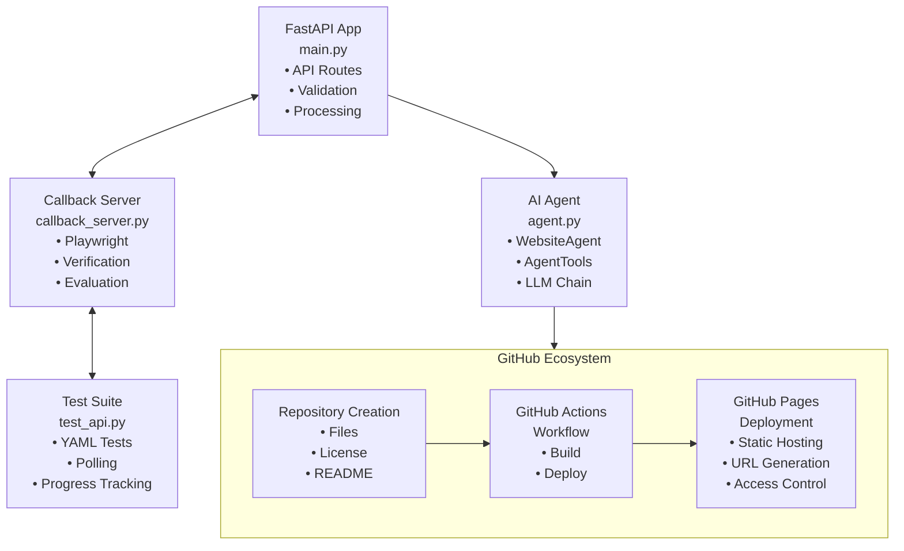
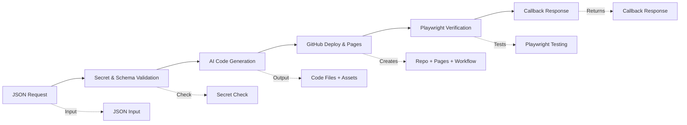
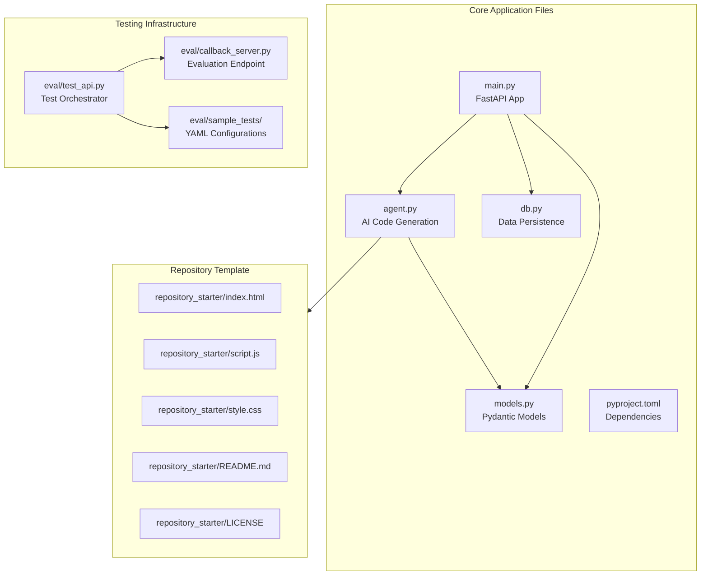
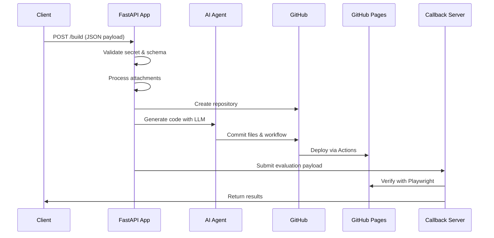
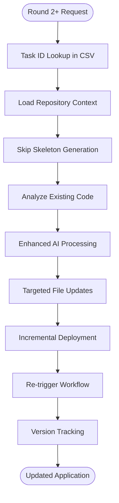
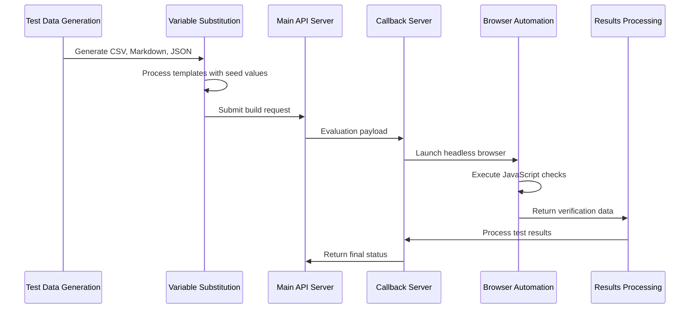

# Website Developer API

A comprehensive automated web application builder system that leverages AI/LLM technology to generate, deploy, and verify complete web applications. This system accepts JSON requests, creates optimized web applications, deploys them to GitHub Pages, and validates functionality through automated browser testing.

## Overview

The Website Developer API is a complete end-to-end solution for automated web application generation and deployment. It combines multiple technologies to create a robust pipeline from requirements to deployed applications with automated verification.

### Key Capabilities

- **AI-Powered Code Generation**: Uses Google Gemini LLM with LangChain for intelligent code synthesis
- **Multi-Round Development**: Supports iterative enhancement of applications across multiple rounds
- **Automated Testing**: Playwright-based browser automation for functional verification
- **GitHub Integration**: Complete repository lifecycle management with Pages deployment
- **YAML-Driven Testing**: Configurable test scenarios with variable substitution
- **Real-time Verification**: Polling-based result checking with callback server integration

## Tech Stack

### Core Backend Technologies
- **FastAPI** (0.104.0+) - High-performance async web framework
- **Python 3.12+** - Modern Python with full async/await support
- **Pydantic** (2.12.0+) - Data validation and settings management
- **Uvicorn** (0.37.0+) - Lightning-fast ASGI server

### AI/LLM Integration
- **LangChain** (0.3.27+) - LLM application framework with tool integration
- **LangGraph** (0.6.10+) - Stateful agent orchestration
- **Google Gemini** (langchain-google-genai 2.1.12+) - Advanced AI code generation
- **React Agent Pattern** - Reasoning and acting with iterative tool usage

### GitHub & Version Control
- **PyGithub** (1.59.0+) - Complete GitHub API integration
- **Git Low-Level API** - Atomic commit operations for clean history
- **GitHub Actions** - Automated CI/CD pipeline deployment
- **GitHub Pages** - Static site hosting with workflow integration

### Testing & Verification Infrastructure
- **Playwright** (1.40.0+) - Cross-browser automation and testing
- **PyYAML** (6.0.1+) - Test configuration parsing and management
- **Async HTTP** (httpx 0.25.0+) - Non-blocking external API communication
- **Callback Server Architecture** - Evaluation result processing

### Data Management
- **CSV-based Storage** (db.py) - Task and repository persistence
- **Thread-safe Operations** - Concurrent access handling
- **Data URI Processing** - Binary attachment handling

## Application Architecture

### Main Components



### Data Flow Architecture



## Codebase Structure



### Core Application Files

```
├── main.py                 # FastAPI app with AppBuilder class
│   ├── AppBuilder          # Main orchestration class
│   ├── API Routes          # /build, /health endpoints  
│   ├── GitHub Integration  # Repository & Pages management
│   ├── Background Tasks    # Async processing pipeline
│   └── Error Handling      # Comprehensive exception management
│
├── agent.py               # AI-powered code generation
│   ├── WebsiteAgent       # LLM-based application builder
│   ├── AgentTools         # Repository manipulation tools
│   ├── LangChain Setup    # Gemini model configuration
│   └── Repository Context # File analysis and understanding
│
├── models.py              # Pydantic data models
│   ├── BuildRequest       # API request validation
│   ├── BuildResponse      # API response structure
│   ├── EvaluationPayload  # Callback data format
│   └── Attachment         # File attachment handling
│
├── db.py                  # Data persistence layer
│   ├── TaskRepository     # CSV-based storage
│   ├── Thread Safety      # Concurrent access handling
│   ├── Task Tracking      # Round progression management
│   └── Repository Links   # GitHub URL associations
│
└── pyproject.toml         # Python dependencies and metadata
```

### Testing Infrastructure

```
├── eval/
│   ├── test_api.py        # Comprehensive test orchestrator
│   │   ├── APITester      # Test execution engine
│   │   ├── YAML Loading   # Configuration parsing
│   │   ├── Polling Logic  # Result verification
│   │   └── Progress UI    # User feedback system
│   │
│   ├── callback_server.py # Evaluation endpoint
│   │   ├── FastAPI Server # Callback receiver
│   │   ├── Playwright     # Browser automation
│   │   ├── Test Execution # Check validation
│   │   └── Result Storage # Verification tracking
│   │
│   └── sample_tests/      # YAML test configurations
│       ├── test1.yaml     # Sum-of-sales scenario
│       ├── test2.yaml     # Markdown-to-HTML conversion
│       └── test3.yaml     # GitHub user lookup
```

### Repository Template

```
├── repository_starter/    # Base template for generated sites
│   ├── index.html        # Modern responsive HTML5 structure
│   ├── script.js         # Vanilla JavaScript with URL handling
│   ├── style.css         # CSS Grid/Flexbox responsive design
│   ├── README.md         # Professional documentation template
│   └── LICENSE           # MIT license template
```

## Overall Application Flow

### Round 1: Initial Application Generation



1. **Request Reception** (`POST /build`)
   - JSON payload validation via Pydantic models
   - Secret authentication against environment variable
   - Background task creation for async processing

2. **Attachment Processing**
   - Data URI parsing and Base64 decoding
   - Binary file detection and proper encoding
   - MIME type preservation for web compatibility

3. **Repository Initialization**
   - Unique repository name generation with collision handling
   - GitHub repository creation via PyGithub
   - Initial skeleton file structure deployment

4. **AI Enhancement** (WebsiteAgent)
   - Repository context analysis (existing files, structure)
   - LLM prompt preparation with requirements and constraints
   - Intelligent code generation using Google Gemini
   - Tool-based file manipulation (create, update, delete)

5. **Deployment Pipeline**
   - GitHub Actions workflow creation (.github/workflows/pages.yml)
   - GitHub Pages enablement via API
   - Atomic commit with all files using Git low-level operations

6. **Verification & Callback**
   - Workflow completion monitoring with timeout handling
   - Pages accessibility verification with retry logic
   - Evaluation payload submission to callback URL
   - CSV database persistence for round tracking

### Round 2+: Iterative Enhancement



1. **Continuation Logic**
   - Task ID lookup in CSV database for existing repository
   - Repository context loading for current state analysis
   - Skip skeleton generation (existing codebase preservation)

2. **Enhanced AI Processing**
   - Repository context integration in LLM prompt
   - Existing code analysis and modification strategies
   - Targeted file updates without complete rewrites

3. **Incremental Deployment**
   - File-level updates to existing repository
   - Workflow re-triggering for new deployment
   - Version tracking with commit SHA progression

## Testing System Architecture

### YAML-Driven Test Configuration

```mermaid
graph LR
    subgraph YAML["YAML Test Files"]
        Test1[test1.yaml<br/>Sum of Sales]
        Test2[test2.yaml<br/>Markdown to HTML]  
        Test3[test3.yaml<br/>GitHub User Lookup]
    end
    
    subgraph Processing["Test Processing"]
        Parser[YAML Parser]
        Variables[Variable Substitution]
        DataGen[Test Data Generation]
    end
    
    subgraph Execution["Test Execution"]
        MainAPI[Main API Server]
        CallbackAPI[Callback Server]
        Playwright[Browser Automation]
    end
    
    YAML --> Parser
    Parser --> Variables
    Variables --> DataGen
    DataGen --> MainAPI
    MainAPI --> CallbackAPI
    CallbackAPI --> Playwright
    Playwright --> |Results| CallbackAPI
```



The testing system uses YAML files to define comprehensive test scenarios:

```yaml
id: sum-of-sales
brief: Publish a single-page site that fetches data.csv from attachments...
attachments:
  - name: data.csv
    url: data:text/csv;base64,${seed}
checks:
  - js: document.title === `Sales Summary ${seed}`
  - js: !!document.querySelector("link[href*='bootstrap']")
round2:
  - brief: Add a Bootstrap table #product-sales...
    checks:
      - js: document.querySelectorAll("#product-sales tbody tr").length >= 1
```

### Automated Verification Pipeline



1. **Test Data Generation**: Dynamic creation of CSV, Markdown, and JSON test data
2. **Variable Substitution**: Template processing with seed values and attachment data
3. **Dual-Server Architecture**: Main API + callback server for result processing
4. **Playwright Integration**: Headless browser automation with JavaScript execution
5. **Polling Mechanism**: Non-blocking result verification with progress indicators

## Deployment & Infrastructure

### GitHub Actions Workflow

Automatically generated for each repository:

```yaml
name: Deploy to GitHub Pages
on:
  push:
    branches: ["main"]
  workflow_dispatch:
permissions:
  contents: read
  pages: write
  id-token: write
jobs:
  deploy:
    environment:
      name: github-pages
      url: ${{ steps.deployment.outputs.page_url }}
    runs-on: ubuntu-latest
    steps:
      - name: Checkout
      - name: Setup Pages  
      - name: Upload Artifact
      - name: Deploy to GitHub Pages
```

### Environment Configuration

```bash
# Required
GITHUB_TOKEN=ghp_...              # GitHub Personal Access Token
API_SECRET=your_secret_here       # Request validation secret
GOOGLE_API_KEY=AIza...           # Google Gemini API access

# Optional
API_URL=http://localhost:8000     # Main API endpoint
CALLBACK_URL=http://localhost:9000 # Verification endpoint
PORT=8000                        # Server port
HOST=0.0.0.0                     # Server host
```

## Advanced Features

### Repository Context Integration

The AI agent analyzes existing repository state:

- **File Content Analysis**: Reads and understands current codebase
- **Directory Structure Mapping**: Builds complete file tree representation
- **Binary File Detection**: Skips non-text files for efficient processing
- **Content Truncation**: Limits context size while preserving key information

### Intelligent Prompting System

Enhanced LLM interactions with:

- **Repository Context Tags**: XML-delimited sections for structured input
- **Requirement Prioritization**: Checks and brief compliance emphasis
- **Code Quality Guidelines**: Professional standards enforcement
- **README Generation**: Automated documentation creation

### Error Handling & Resilience

- **Timeout Management**: Configurable timeouts for long-running operations
- **Retry Logic**: Exponential backoff for external API calls
- **Graceful Degradation**: Fallback behaviors for service unavailability
- **Comprehensive Logging**: Detailed operation tracking for debugging

## Performance & Scalability

### Async Architecture Benefits

- **Non-blocking Processing**: Background task execution prevents request blocking
- **Concurrent Operations**: Multiple build requests handled simultaneously
- **Resource Efficiency**: Optimal CPU and I/O utilization patterns

### Optimization Features

- **Single Commit Operations**: Atomic Git operations for clean history
- **Selective File Processing**: Only necessary files updated in round 2+
- **Context Size Management**: Intelligent truncation for LLM efficiency
- **Connection Pooling**: Reused HTTP connections for external APIs

## Development & Extension

### Local Development Setup

```bash
# Clone repository
git clone <repo-url>
cd website-developer

# Install dependencies  
pip install -e .

# Environment setup
cp .env.example .env
# Edit .env with your tokens

# Run main API
python main.py

# Run callback server (separate terminal)
cd eval
python callback_server.py

# Run tests (separate terminal)  
cd eval
python test_api.py
```

### AI Model Integration

The system is designed for easy LLM swapping:

```python
# Current: Google Gemini
self.llm = ChatGoogleGenerativeAI(model="gemini-2.5-flash")

# Alternative: OpenAI
# self.llm = ChatOpenAI(model="gpt-4")

# Alternative: Azure OpenAI  
# self.llm = AzureChatOpenAI(...)

# Alternative: Local models
# self.llm = Ollama(model="llama2")
```

### Custom Tool Integration

Extend AgentTools for additional capabilities:

```python
@tool
def custom_api_integration(self, endpoint: str, data: dict) -> dict:
    """Custom tool for external API integration."""
    # Implementation here
    pass
```

## Monitoring & Analytics

### Built-in Tracking

- **Task Progression**: Round-by-round development tracking
- **Repository Lifecycle**: Creation to deployment timeline
- **Verification Results**: Test pass/fail statistics
- **Performance Metrics**: Request processing times

### CSV Database Schema

```csv
task,email,repo_name,repo_url,latest_commit_sha,pages_url,latest_round,created_at,updated_at
sum-of-sales,test@example.com,generated-sum-of-sales,https://github.com/user/repo,abc123,https://user.github.io/repo/,2,2025-01-01 12:00:00,2025-01-01 12:05:00
```

## Security Considerations

### Authentication & Authorization
- **API Secret Validation**: Environment-based secret verification
- **GitHub Token Security**: Scoped personal access tokens
- **Request Validation**: Comprehensive input sanitization

### Safe Code Generation
- **Sandboxed Execution**: No local code execution during generation
- **Content Filtering**: LLM output validation for security
- **Repository Isolation**: Each task gets independent repository

## Production Deployment

### Recommended Infrastructure

```bash
# Production server setup
pip install gunicorn
gunicorn main:app -w 4 -k uvicorn.workers.UvicornWorker

# Docker deployment
FROM python:3.12-slim
COPY . /app
WORKDIR /app
RUN pip install -e .
CMD ["gunicorn", "main:app", "-w", "4", "-k", "uvicorn.workers.UvicornWorker", "--bind", "0.0.0.0:8000"]

# Environment management
export GITHUB_TOKEN=...
export API_SECRET=...
export GOOGLE_API_KEY=...
```

### Scaling Considerations

- **Load Balancing**: Multiple API instances behind reverse proxy
- **Database Migration**: Move from CSV to PostgreSQL/MongoDB for scale
- **Queue System**: Redis/Celery for background task management
- **Monitoring**: Prometheus metrics and Grafana dashboards

## API Documentation

### Complete Build Request Example

```bash
curl -X POST http://localhost:8000/build \
  -H "Content-Type: application/json" \
  -d '{
    "email": "developer@example.com",
    "secret": "your-api-secret",
    "task": "sum-of-sales",
    "round": 1,
    "nonce": "unique-request-id",
    "brief": "Create a sales dashboard that reads CSV data and displays totals",
    "checks": [
      "Repo has MIT license",
      "README.md is professional", 
      "Displays total sales in #total-sales element",
      "Bootstrap 5 loaded from CDN"
    ],
    "evaluation_url": "http://localhost:9000/",
    "attachments": [
      {
        "name": "sales.csv",
        "url": "data:text/csv;base64,cHJvZHVjdCxyZWdpb24sc2FsZXMKUHJvZHVjdCBBLE5vcnRoLDEwMC41MA=="
      }
    ]
  }'
```

### Response Formats

```json
{
  "status": "accepted",
  "message": "Build request accepted and processing started",
  "task": "sum-of-sales", 
  "round": 1
}
```

## Contributing

### Development Workflow

1. Fork the repository
2. Create feature branch (`git checkout -b feature/amazing-feature`)
3. Make changes with comprehensive tests
4. Ensure all tests pass (`python eval/test_api.py`)
5. Commit changes (`git commit -m 'Add amazing feature'`)
6. Push to branch (`git push origin feature/amazing-feature`)
7. Open Pull Request with detailed description

### Code Standards

- **Type Hints**: All functions must include proper type annotations
- **Docstrings**: Comprehensive documentation for classes and methods
- **Error Handling**: Explicit exception handling with logging
- **Testing**: Unit tests for new functionality

## License

MIT License - This project is open source and available under the [MIT License](LICENSE).

## Roadmap

### Planned Features

- **Multi-Model Support**: Integration with Claude, GPT-4, and local models
- **Advanced Testing**: Visual regression testing with image comparison
- **Template System**: Pre-built application templates for common use cases
- **Plugin Architecture**: Extensible plugin system for custom functionality
- **Real-time Collaboration**: Multi-user development sessions
- **Performance Analytics**: Detailed metrics dashboard and reporting

### Community

- **Documentation**: Comprehensive guides and tutorials
- **Examples**: Sample implementations and use cases
- **Support**: Community forum and issue tracking
- **Integrations**: Third-party service connectors and APIs
